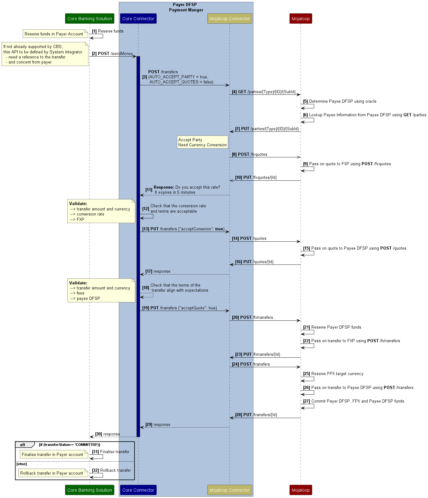
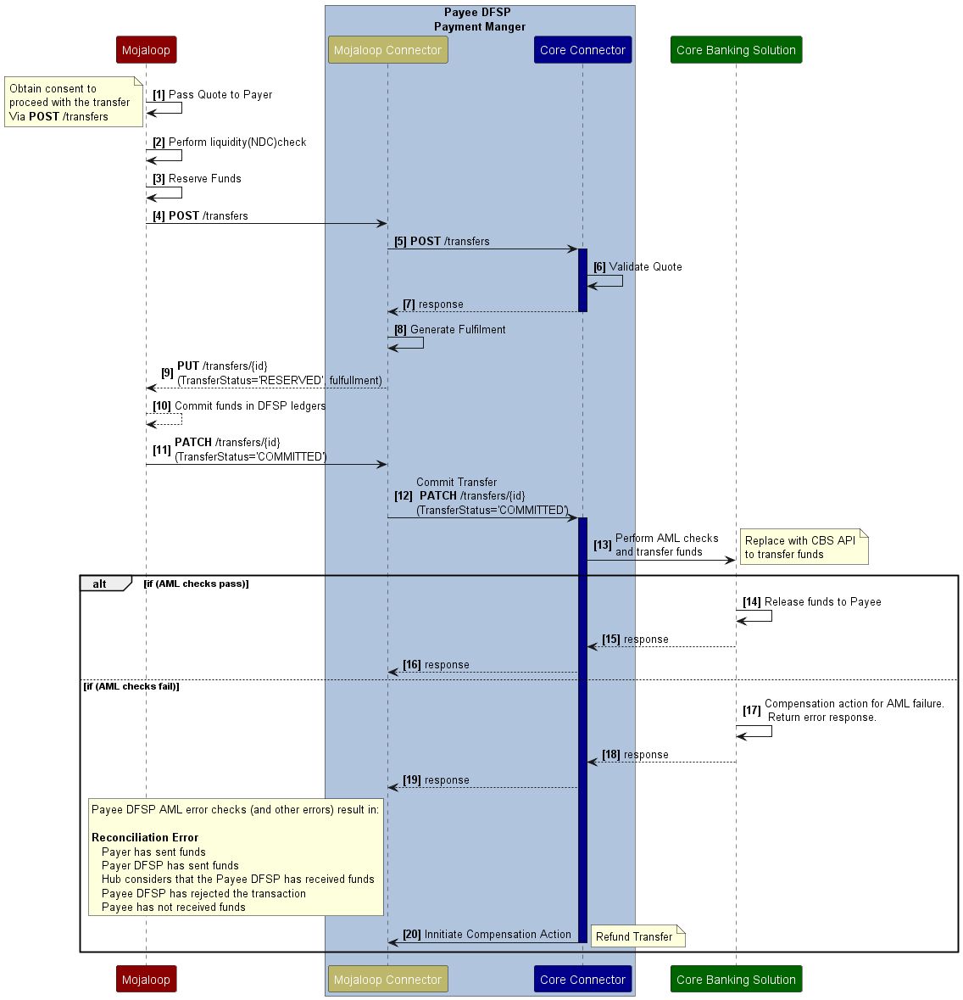

# Inclusive Instant Payment System (IIPS) Integration
## Introduction
When integrating legacy core banking systems into a modern, real-time, push based transaction flow there can be some challenges. These are largely based on what vendor provided integration API's are on offer. This document discusses what an ideal integration should look like, some of the typical limitations seen in vendor API's, and flow patterns that are used to overcome some of these limitations. The mitigation mechanisms and implications of each approach are discussed.

### Payer DFSP Integration vs Payee DFSP Integration
The Payer DFSP organization and the Payee DFSP organization in a transfer need to provide very different integrations, and take on different responsibilities in a transfer. As a result this document will focus on integrations as first a Payer organization, and then as a Payee organization. It is also important to note that all integrations built need to support both payer and payee integrations even if the use case only dictates a single direction. This is because inside Mojaloop the only mechanism for reversing a transfer is to initiate a transfer in the reverse direction. Mojaloop supports push payments which aligns with the level-one principle aimed at achieving financial inclusion.
### Two phase (Reserve and Commit) transfer vs Single phase committed transfer
To provide some context, the anatomy of a Mojaloop transfer the two phase (reserve and Commit) transfer are integration steps that occur in the Mojaloop transfer phase. Making use of the two step reserve & commit transfer is the ideal for building integrations. This is because both systems can perform reservations before funds are committed. This pattern maximizes use of liquidity, minimizes the time funds are reserved from the payer and thereby reduces reconciliation effort. Often the core-banking system in use does not provide this functionality, meaning an alternative approach is needed. This document starts by first describing the  integration patterns that use the ideal reserve-commit integration, and then discusses approaches that can be taken for integrating single phase commit transfers. Some of these are anti-patterns and should not be used. These are discussed too. 
### Define use-case based API’s
Because Scheme rules and regulations require certain payment use-cases to have additional fields that are easier to describe and enforce through API definitions, it is recommended to standardize the Payer DFSP’s API that initiates the payment for different use-cases.  This approach can be extended to the payee DFSP’s API if found necessary based on the requirements.
## Payer DFSP Integration Patterns
### Reserve-Commit vs Transfer and Reversal Integrations
Both integration patterns discussed below show the reserve-commit integration as the Payer DFSP organization the reserve. If a reserve-commit is not  available, then the following integrations can be used as a substitute.
1. Reservation in Payer's Account → Transfer from Payer’s Account
1. Finalize transfer into Payer’s Account → No action necessary
1. Rollback transfer into Payers Account → Reverse the transfer in step 1. which should return funds to Payer’s Account

### Number of Integration points with Core Banking system
The payer DFSP integration can choose how many points of interaction are required with the core banking system. These points of integration align with the three phases of a Mojaloop transfer, and allow the core-banking system to make checks and confirmations before proceeding with the final transfer phase. These can be described as integrations to:
1. Initiate the transfer
1. Confirm the party
1. Confirm the terms and conditions of the cross-currency conversion
1. Confirm the terms and conditions of the transfer
1. Notify the payer of the transfer state I.e. is it complete or aborted

Most core-banking systems don't support integrations at all of these types of integrations, so this document will discuss two integration patterns. The first pattern is called Payer DFSP Confirmation Integration where steps 2, 3 and 4 are combined into a single confirmation of all terms before proceeding. The second pattern is a Payer DFSP Single Integration where no confirmation of the transfer terms are integrated into the core-banking system. 
## Payer DFSP Confirmation Integration Pattern
This pattern consists of two parts namely obtaining the  consent part and executing the transfer part. The first obtaining consent part takes the initiated payment, and returns all the terms of the transfer so that they can be confirmed by the core banking system. I.e. it provides an integration to support the Payer being presented with the terms of the transfer before proceeding with the transfer. This is a Mojaloop and level one principle I.e. transparent fees. The transfer terms include the Payee information, the currency conversion information, and the associated fees. The transfer part of this pattern begins if the payer agrees to these terms.
### Obtaining Consent
There are three important integration considerations when building this part of the integration. Firstly the initiating API design. It is recommended that this aligns with a scheme use case, and includes all required fields and expectations of the scheme. I.e. clear assignment of which field/parameters are optional and what type definition they hold. If this is an ISP20022 API, then it is recommended that expected fields/parameters are marked accordingly and a definition of the Market implementation of that API is still provided for that use-case

Secondly, currency conversion terms should be validated. The foreign exchange provider the amount and the currency and conversion rate should be checked to make sure that they align with expectations and are acceptable to proceed.

Thirdly, the transfer terms should be validated. The payee DFSP organization should be validated. I.e. check to ensure that this agreement is being made with the organization that you expect. The transfer amount should be checked. This is the amount that will be deducted from the pre-funded liquidity and ultimately transferred to the FXP and Payee organization. The fees charged should be checked. I.e. to ensure that they are reasonable and within expectations.
The integration can now return this validated information back to the core banking system to ask for confirmation of the transfer terms.

### Executing the Transfer
The executing the transfer part of this integration pattern begins when the Payer accepts the terms of the transfer. A reservation of the funds in the Payer’s account must be made before transfer is initiated. When notification of the transfer state is received, then the transfer from the Payer’s account should either be  finalized or rolled back based on whether the transfer state is committed or not.

## Payer DFSP Single Integration
The single payer DFSP integration pattern is appropriate if the core-banking system is not able to ask for payers consent before proceeding with the transfer. This is not ideal when fees are involved, as this is a level-one principle that is not being addressed. So all attempts to not use this pattern, should be made. There are however some use cases where the use of this pattern is unavoidable. In those cases, the premise that the integration should take, is to then take on the responsibility for those checks in the integration. I.e. The checks on the payee details, terms of the conversion, terms of the transfer still need to be taken, however they are made based on an agreement with the payer to be within certain parameters that the integration design is configured to enforce. The question that need to be answered are:
1. What validation checks can be made to verify the payee details?
1. How is the conversion rate validated?
1. How do I judge whether the fees are appropriate, and what checks must be made to validate the transfer amount.

## Payee DFSP Integration Patterns
Three points of Integration points with Core Banking system
The payee DFSP integration must respond to each phase of a mojaloop transfer, so therefore has to do a three phase integration with the core-banking system. There are certain functions that a Payee DFSP must assume in each of the phases. Let’s discuss those now.
1. **Discovery**  
In Discovery the payee DFSP is presented with a payee payment identifier. The payee DFSP is required to validate that this payee identifier does refer to an account controlled by the payee DFSP, and that this account is active and can accept funds. The payee DFSP additionally specifies the currency/s in which this account can accept funds in. If these requirements are met, the payee DFSP is then obligated to return some identifiable information that the Payer can use to validate that this is the correct account.  E.g. the account holder’s name.
2. **Agreement**  
In Agreement the payee DFSP must perform all validations required to perform the transfer. For example AML check, KYC checks and transfer threshold limit checks. By assenting to the terms of a payment, the payee DFSP commits to crediting the funds to the beneficiary, provided the instruction is received before the expiry time and the payee DFSP is not prevented by force majeure (e.g. if the beneficiary's account has been suspended in the interim.) The payee DFSP then compiles the terms of the transfer which includes the fees. These terms become the bases upon which the transfer is executed.
3. **Transfer**  
If the payer DFSP’s customer agrees to the terms of the transfer, then the transfer phase is started. The payee DFSP is most at risk during this phase, as it is the payee DFSP that releases funds to the Payee. The payee DFSP is required to provide the cryptographic fulfillment of the terms to the hub before the transfer timeout. If these conditions are met, then the hub will allocate the pre-funded liquidity to cover that transfer which gets distributed into the liquidity accounts during the settlement process.

### Payee DFSP Discovery Integration Pattern
There is a single pattern for building payee DFSP Discovery integrations. 

The function that need to be catered for are:
1. Validating Supported Scheme Payment Identifiers
1. Extracting Account Information from the Payment Identifiers
1. Validate the account by checking that it exists, is active and can receive funds in the configured currency
1. Query the client details for that account

### Payee DFSP Agreement Integration Pattern
There is a single pattern for building payee DFSP Agreement integrations. Here it is.

The Payer DFSP is required to: 
1. Validate the Payer DFSP organization.
1. Validate the payment payee identifier.
1. Validate that the account is in good standing and can receive funds in the provided currency.
1. Perform all compliance checks which may include AML.
1. Calculate any fees that must be included in the terms of the transfer.
1. Build the terms of the transfer.

The terms of the transfer are then returned.

### Payee DFSP Transfer Integration Pattern
The ideal pattern for completing a transfer as Payee DFSP includes a reservation step that aligns with the Transfer phase, and then a commit phase that aligns with the notification that the transfer has been completed. Please see the details below.

### Payee DFSP Single integration on PATCH notification
If the DFSPs core banking system only supports a single transfer integration, then this pattern is the preferred integration. The approach only initiates the transfer on the patch notification after the transfer is committed in Mojaloop. This approach has the benefit of only releasing funds after the transaction has been completed and the position ledgers in Mojaloop set to fund the transfer. The disadvantage of this integration pattern is when executing the transfer in the core-banking system fails. If this integration approach is chosen, then effort should go into designing the mitigation steps that must be made if the transfer fails, in order to prevent reconciliation errors. 

### Anti-pattern: Payee DFSP Single integration on transfer

This pattern is considered an anti-pattern and where possible avoided. This design performs the single interaction during the transfer phase. If there is an error and the transfer aborts, then compensation action of the aborted transfer is made in the core banking system. The reason why this is not recommended, is because this transfer clears immediately, it is not possible to guarantee success of the compensation action. 

There is one use case where this integration pattern may be used, and that is if the account involved is a loan and there is no release of funds but rather an acknowledgement of a debt payment. 

## Foreign Exchange Provider Integration Patterns

The foreign exchange provider participant in a Mojaloop scheme, must provide quotes and conversions to support the transfers. This is inline with DFSP integrations with one major different. The conversion is only confirmed after the dependent transfer is committed. This means that the conversion can only be committed after the fxTransfer PATCH-PUT notification.
### FX Quote Integration

The ILP is provided to the DFSP as the digital signed terms of the conversion.

### FX Transfer Integration

The ILP fulfullment is release to the DFSP to indicate commitment to the transfer. Transfer is only committed to after PATCH-PUT notification is received.