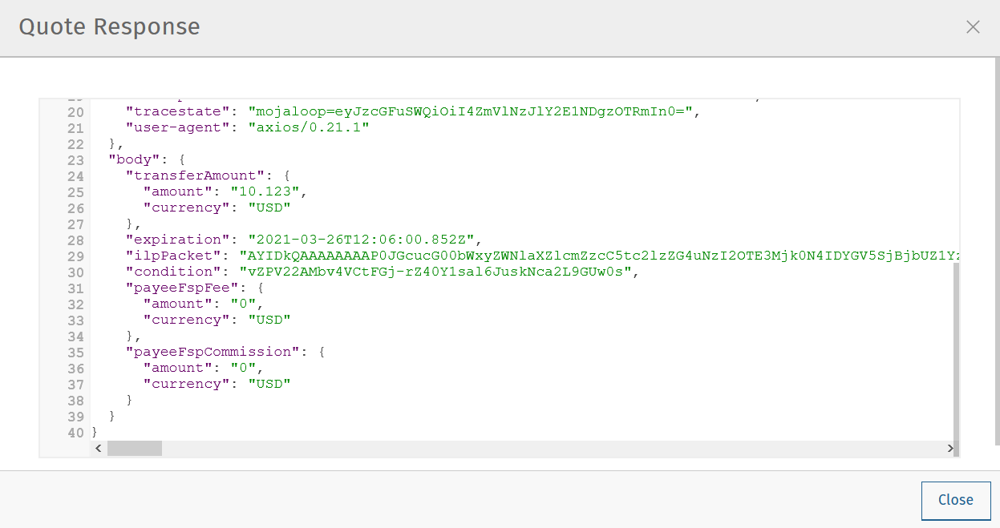

# Payment Manager's Transfers Overview Guide

The Business Dashboard page (accessible from the left-hand navigation pane) currently contains only mock data and the related functionality is not available yet. It is planned to be added in a future version of the product.

The Transfers Overview page provides visualization of transaction details and the ability to query and observe each transfer’s status.

## Find a Transfer
The **Find a Transfer** button  find a transfer button at the top of the page allows you to find a particular transfer.

On clicking the button, a window is displayed where you can:
- search for a transfer by its Transfer ID
- do advanced filtering using multiple search criteria (this is useful when you do not have a Transfer ID at your disposal)

### Find a transfer based on its Transfer ID
Use the Basic Find a Transfer tab to find a transfer based on its Transfer ID:
1. Enter the transfer’s identifier in the **Transfer ID** field. Entering only a snippet of the full transfer ID string will also return a result.

1. Click the **Find Transfers** button.

1. To find out more information about the transfer, click the transfer item once.
The **Transfer Details** window pops up showing detailed information about the transfer on a **Basic Information** tab and a **Technical Details** tab.

The Basic Information tab displays the following information:
- **Transfer ID:** The unique identifier of the transfer.
- **Transfer State:** Indicates if the transfer has succeeded, is pending, or an error has occurred.
- **Batch:** The unique identifier of the settlement batch in which the transfer was settled. If the transfer has not been settled yet, it says N/A.
- **Date Submitted:** The date and time when the transfer was initiated, expressed as an ISO-8601 formatted timestamp. A more readable version of the format is yyyy-MM-ddTHH:mm:ss.SSS[±HH:MM]
If the time is in UTC, there is a Z added directly after the time without a space. For example, "09:30 UTC" is represented as 09:30:00:000Z.
If the time is not in UTC, a UTC offset is appended to the time in the place of Z, in the form: [±HH:MM]. For example, "09:30 in New York" is 09:30:00:000−05:00, or "09:30 in Yangon" is 09:30:00:000+06:30.
- **Amount:** The transfer amount.
- **Currency:** The transfer currency.
- **Sender:** The payer of the transfer.
- **Sender Details:** The unique identifier of the payer (typically, a MISIDN, that is, a mobile number).
- **Recipient:** The payee of the transfer.
- **Recipient Details:** The unique identifier of the payee (typically, a MISIDN, that is, a mobile number).
- **Institution:** The identifier of the DFSP serving the payee.
- **Direction:** The direction of the transfer (outbound or inbound from the perspective of the DFSP inspecting the transfer).

The **Technical Details** tab also displays information about the Payer and Payee party of the transfer. On clicking the **Payer Information** or **Payee Information** button, a window pops up that displays the following details:
- **Id Type:** The type of payer/payee identifier used (for example, MSISDN).
- **Id Value:** The value of the payer/payee identifier (for example, digits of a mobile number).
- **Display Name:** The display name of a payer/payee, which may not be the full name of the party.
- **First Name:** The first name of a payer/payee.
- **Middle Name:** The middle name of a payer/payee.
- **Last Name:** The last name of a payer/payee.
- **Date Of Birth:** The date of birth of a payer/payee.
- **Merchant Classification Code:** The unique identifier of a merchant (relevant in the case of person-to-business transfers).
- **FSP Id:** The unique identifier of the DFSP serving the payer/payee.
- **View Extension List:** This option is only active when an extension list is present in the party object in the quote request body.

 
In addition to party information, details about the transfer message sequence are also available by clicking these buttons:
- **Party Lookup Response:** Displays a **Party Lookup Response** pop-up window, which provides the API response message that is returned to a party lookup request. This option is only active when a GET /parties response can be found for the transfer (that is, for sending DFSPs).
- **Quote Request:** Displays a **Quote Request** pop-up window, which provides the API request message that is sent to request a quote.
 - **Quote Response:** Displays a **Quote Response** pop-up window, which provides the API response message that is returned to a quote request.
- **Transfer Prepare:** Displays a **Transfer Request** pop-up window, which provides the API request message that is sent to request a transfer.
- **Transfer Fulfil:** Displays a **Transfer Fulfil** pop-up window, which provides the API response message that is returned to a transfer request.

### Find a transfer using multiple search criteria
Use the Advanced Filtering tab to find a transfer when you do not know its Transfer ID. You can search for a transfer based on:
- the approximate time when the transfer occurred
- the institution (DFSP) that was involved in the transfer
- the status of the transfer

 

To find a transfer:
1. Use the date picker fields to specify the time period in which the transfer happened. Note that the time of the transfer is the time in your timezone.
1. In the **Contains Institution** field, enter the fspId of the DFSP that participated in the transfer.
1. In the **Transfer Status** field, select the appropriate value (Success, Pending, Error) from the drop-down list.
1. Click the **Find Transfers** button. A list of transfers that match your search criteria is displayed.

1. Click an entry in the search results to view details of that particular transfer. The Transfer Details window pops up, which displays:
   - A Basic Information tab with details, such as transfer amount, sender, recipient, and so on.
   - A Technical Details tab with low-level technical details, such as the actual party lookup, quote, or transfer messages. This is useful for technical personnel performing a debug.

For further information on the details that the Transfer Details pop-up window provides, see the descriptions and screenshots in Find a transfer based on its Transfer ID.

## Successful Transfers

The Successful Transfers graph is showing a timeline of the past 24 hours and displays the percentage of successful transfers per minute. The time zone of the timeline is UTC.

The granularity of the graph is customizable. For example, you can zoom in on areas of interest and find out the timestamps of transfers that seem not to have been successful. 

To be able to zoom, you must be in selection zoom mode. Ensure you have the **Selection Zoom** button  selected. This is the default setting.
 
Click the **Zoom In** or **Zoom Out** buttons  to zoom in or out. To zoom in on a particular area of the graph, select an area by clicking the graph, drag the mouse left or right, and release the mouse.

Click the **Reset Zoom** button   to reset the timeline to the original 24-hour granularity.

Another way to change the displayed range of the timeline is to pan an area. Click the **Panning** button , then click the timeline and drag your mouse to the left or right. Panning keeps the selected zoom granularity and lets you move along the X (time) axis.

To return to selection zoom mode, click the Selection Zoom button .

To download a chart in .svg, .png, or .csv format, click the **Menu** button .

# Average Transfer Time (E2E)
The Average Transfer Time (E2E) graph is showing your transfer latency with the Hub.

You can zoom in on particular areas if you spot an anomaly. This is useful when debugging issues.
 
# Total Transfer Statuses
The **Total Transfer Statuses** widgets display the total number of successful, pending, and failed transfers.

# Transfers Errors Overview
The **Transfers Errors Overview** pie chart shows a breakdown of the types of errors that caused failed transfers.

The table below the pie chart lists failed transfers. If there are more than four errors, then a **View All Errors** button is displayed, which allows you to check the full list of errors. To get the complete list of errors, click the **View All Errors** button. The **Transfers Errors** window pops up.

